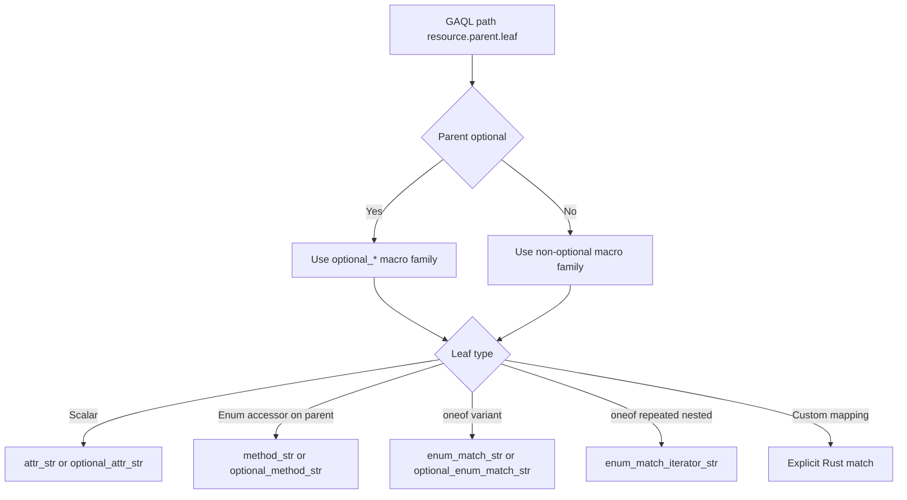

How to implement get() match arms in GoogleAdsRow

Overview
- This spec describes how to implement additional match arms in [impl GoogleAdsRow::get()](src/lib.rs:65) to return string values for GAQL-selected fields across supported resources.
- Patterns are extracted from macros defined in [macro_rules! attr_str()](src/lib.rs:71), [macro_rules! optional_attr_str()](src/lib.rs:89), [macro_rules! method_str()](src/lib.rs:104), [macro_rules! optional_method_str()](src/lib.rs:123), [macro_rules! enum_match_str()](src/lib.rs:146), [macro_rules! enum_match_iterator_str()](src/lib.rs:160), and [macro_rules! optional_enum_match_str()](src/lib.rs:198), and from existing arms in [match field_name](src/lib.rs:215).

Scope
- Resources already implemented in [src/lib.rs](src/lib.rs): campaign, campaign_criterion, campaign_budget, ad_group, ad_group_ad, ad, ad_group_criterion, ad_group_ad_asset_view, asset_group, audience, bidding_strategy, customer, customer_client, label, search_term_view, smart_campaign_search_term_view, change_event, metrics, segments.
- Cross-checked protos: [campaign.proto](proto/google/ads/googleads/v19/resources/campaign.proto), [ad_group.proto](proto/google/ads/googleads/v19/resources/ad_group.proto), [ad_group_ad.proto](proto/google/ads/googleads/v19/resources/ad_group_ad.proto), [ad_group_criterion.proto](proto/google/ads/googleads/v19/resources/ad_group_criterion.proto), [campaign_criterion.proto](proto/google/ads/googleads/v19/resources/campaign_criterion.proto), [ad.proto](proto/google/ads/googleads/v19/resources/ad.proto), [ad_type_infos.proto](proto/google/ads/googleads/v19/common/ad_type_infos.proto), [criteria.proto](proto/google/ads/googleads/v19/common/criteria.proto), [metrics.proto](proto/google/ads/googleads/v19/common/metrics.proto), [segments.proto](proto/google/ads/googleads/v19/common/segments.proto).

Core decision rules by field category
1) Scalar attribute fields (string, int64, double, bool)
- Use [macro_rules! attr_str()](src/lib.rs:71) when the parent resource is guaranteed present in the row for the path.
- Use [macro_rules! optional_attr_str()](src/lib.rs:89) when the parent resource may be absent in the row.
- Nested message fields are addressed by chaining parents inside attr_str, for example campaign.network_settings.* from [Campaign.NetworkSettings](proto/google/ads/googleads/v19/resources/campaign.proto:101).
- Examples:
  - campaign.id int64 → attr_str with single parent: see [Campaign.id](proto/google/ads/googleads/v19/resources/campaign.proto:373).
  - ad_group.id int64 → [AdGroup.id](proto/google/ads/googleads/v19/resources/ad_group.proto:71).
  - campaign.network_settings.target_search_network bool → [Campaign.NetworkSettings.target_search_network](proto/google/ads/googleads/v19/resources/campaign.proto:106).
  - campaign.dynamic_search_ads_setting.domain_name string → [Campaign.DynamicSearchAdsSetting.domain_name](proto/google/ads/googleads/v19/resources/campaign.proto:134).

2) Enum fields exposed as accessor methods on resource structs
- For fields ending with status, type, device (and similar top-level enums with generated accessors), call the resource method and print its debug form using [macro_rules! method_str()](src/lib.rs:104).
- Use [macro_rules! optional_method_str()](src/lib.rs:123) when the parent resource can be absent.
- Rationale: prost generates numeric i32 backing fields for enums, plus convenience methods like status(), r#type(), device() on the resource structs to view the typed enum.
- Examples:
  - ad_group.status → [AdGroup.status](proto/google/ads/googleads/v19/resources/ad_group.proto:85).
  - ad_group.type → [AdGroup.type](proto/google/ads/googleads/v19/resources/ad_group.proto:88); note Rust keyword requires r#type in code.
  - campaign.status → [Campaign.status](proto/google/ads/googleads/v19/resources/campaign.proto:405).
  - campaign.serving_status → [Campaign.serving_status](proto/google/ads/googleads/v19/resources/campaign.proto:408).
  - ad_group_ad.status → [AdGroupAd.status](proto/google/ads/googleads/v19/resources/ad_group_ad.proto:62).
  - ad_group_ad_asset_view.field_type → [AdGroupAdAssetView.field_type](proto/google/ads/googleads/v19/resources/ad_group_ad_asset_view.proto:79).
  - segments.device and segments.day_of_week → [Segments.device](proto/google/ads/googleads/v19/common/segments.proto:153), [Segments.day_of_week](proto/google/ads/googleads/v19/common/segments.proto:151).

3) oneof unions (resource-level variants)
- When a field lives under a oneof, the field access must first select the active variant.
- Use [macro_rules! enum_match_str()](src/lib.rs:146) when the parent resource is present.
- Use [macro_rules! optional_enum_match_str()](src/lib.rs:198) when the parent resource may be absent.
- Examples:
  - ad_group_criterion.criterion oneof → [AdGroupCriterion.oneof criterion](proto/google/ads/googleads/v19/resources/ad_group_criterion.proto:275):
    - .keyword.text string → [KeywordInfo.text](proto/google/ads/googleads/v19/common/criteria.proto:61).
    - .keyword.match_type enum stored as i32 in the message → [KeywordInfo.match_type](proto/google/ads/googleads/v19/common/criteria.proto:64) renders as number via format!("{}", ...).
  - campaign_criterion.criterion oneof → [CampaignCriterion.oneof criterion](proto/google/ads/googleads/v19/resources/campaign_criterion.proto:91):
    - .keyword.text → [KeywordInfo.text](proto/google/ads/googleads/v19/common/criteria.proto:61).
    - .location.geo_target_constant → [LocationInfo.geo_target_constant](proto/google/ads/googleads/v19/common/criteria.proto:120).

4) oneof unions (ad.ad_data and nested ad type infos)
- Ad.ad_data is a oneof of ad type messages → [Ad.oneof ad_data](proto/google/ads/googleads/v19/resources/ad.proto:121).
- To extract nested scalar fields inside a selected ad type, use [macro_rules! enum_match_str()](src/lib.rs:146).
- To extract and render repeated nested assets inside a selected ad type, use [macro_rules! enum_match_iterator_str()](src/lib.rs:160), mapping each item to a sub-attribute and joining with ", ".
- Examples (ResponsiveSearchAd):
  - .responsive_search_ad.path1/path2 strings → [Ad.responsive_search_ad](proto/google/ads/googleads/v19/resources/ad.proto:164), [ResponsiveSearchAdInfo.path1](proto/google/ads/googleads/v19/common/ad_type_infos.proto:297).
  - .responsive_search_ad.headlines/descriptions repeated AdTextAsset.text → [ResponsiveSearchAdInfo.headlines](proto/google/ads/googleads/v19/common/ad_type_infos.proto:288).

5) Optional parent resources
- Use optional_* macros whenever the parent resource on GoogleAdsRow can be absent in the result row, e.g., campaign_criterion, campaign_budget.
- Returning an empty string "" is the established behavior when the parent is missing or the oneof variant doesn’t match.

6) Repeated fields
- For repeated of simple strings, join with ", " directly.
- For repeated nested messages, use [macro_rules! enum_match_iterator_str()](src/lib.rs:160) to map to a leaf attribute, then join with ", ".
- For repeated enum fields (stored as Vec<i32>), use [macro_rules! repeated_enum_str()](src/lib.rs:213) to convert to comma-separated enum names.
- Example: change_event.changed_fields.paths (FieldMask) are rendered as a single quoted, comma-delimited list in existing code.
- Example: campaign.primary_status_reasons (repeated enum) rendered with repeated_enum_str macro.

7) Custom string mapping overrides
- Some enums are rendered with a custom mapping rather than the default debug or numeric form.
- Example: campaign.bidding_strategy_type in get() maps select variants to custom strings; see [Campaign.bidding_strategy_type](proto/google/ads/googleads/v19/resources/campaign.proto:529) and the match arm under [match field_name](src/lib.rs:281).
- Use explicit match on the accessor method result and return the library’s preferred string tokens.

8) Escaped identifiers
- For methods that collide with Rust keywords (e.g., type), call with raw identifiers, for example r#type() via [macro_rules! method_str()](src/lib.rs:104).

9) Fallback behavior
- If a path is not implemented, return "not implemented by googleads-rs" as in the default arm of [match field_name](src/lib.rs:498).

Resource-specific guidance and examples
Campaign
- Scalars: id, name, base_campaign, start_date, end_date, final_url_suffix → attr_str.
- Enums via accessors: advertising_channel_type, advertising_channel_sub_type, experiment_type, serving_status, status → method_str.
- Nested messages: network_settings.* and dynamic_search_ads_setting.* → attr_str with [campaign, <nested>] parents; see [Campaign.NetworkSettings](proto/google/ads/googleads/v19/resources/campaign.proto:101) and [Campaign.DynamicSearchAdsSetting](proto/google/ads/googleads/v19/resources/campaign.proto:131).
- oneof: campaign_bidding_strategy → [Campaign.oneof campaign_bidding_strategy](proto/google/ads/googleads/v19/resources/campaign.proto:693) usually not read directly, but bidding_strategy_type is handled via accessor + custom mapping.
- PerformanceMaxUpgrade.status (enum accessor) → [Campaign.PerformanceMaxUpgrade.status](proto/google/ads/googleads/v19/resources/campaign.proto:95).

AdGroup
- Scalars: id, name, cpc_bid_micros, cpm_bid_micros, cpv_bid_micros, target_cpa_micros, target_cpm_micros, target_roas → attr_str.
- Enums via accessors: status, type, ad_rotation_mode, effective_target_cpa_source, effective_target_roas_source → method_str.

AdGroupAd and Ad
- AdGroupAd.status (enum accessor) → method_str; [AdGroupAd.status](proto/google/ads/googleads/v19/resources/ad_group_ad.proto:62).
- Ad.type (enum accessor) → method_str; [Ad.type](proto/google/ads/googleads/v19/resources/ad.proto:87).
- Ad.ad_data oneof (e.g., ResponsiveSearchAdInfo) → enum_match_str and enum_match_iterator_str for nested fields; [Ad.oneof ad_data](proto/google/ads/googleads/v19/resources/ad.proto:121).

AdGroupCriterion
- Scalars: bid_modifier, cpc_bid_micros, cpm_bid_micros, cpv_bid_micros, percent_cpc_bid_micros, criterion_id → attr_str.
- Enums via accessors: status, type, effective_*_bid_source → method_str.
- oneof criterion → enum_match_str for KeywordInfo.text and KeywordInfo.match_type (numeric).

CampaignCriterion
- Optional parent: use optional_* macros for campaign_criterion.*.
- Scalars: campaign, criterion_id, display_name → optional_attr_str.
- Enums via accessors: status, type → optional_method_str.
- oneof criterion: Location.geo_target_constant, KeywordInfo.text → optional_enum_match_str.

AdGroupAdAssetView
- Scalars: resource_name, asset → attr_str.
- Enums via accessors: field_type, pinned_field, performance_label → method_str.

Metrics
- All non-list metric values are scalars (double, int64) → attr_str; see e.g., [Metrics.impressions](proto/google/ads/googleads/v19/common/metrics.proto:481), [Metrics.ctr](proto/google/ads/googleads/v19/common/metrics.proto:380).

Segments
- Scalar-like string/int segments (e.g., date, week, hour) → attr_str; see [Segments.date](proto/google/ads/googleads/v19/common/segments.proto:148).
- Enums (ad_destination_type, ad_network_type, click_type, device, day_of_week, month_of_year, product_channel, product_channel_exclusivity, search_term_match_type, slot, recommendation_type) → method_str.

Implementation algorithm for a new match arm
Given a GAQL path like "<parent>.<...nested...>.<leaf>":
1. Identify the top-level parent message on GoogleAdsRow (e.g., campaign, ad_group, ad_group_ad, metrics, segments). Decide optional_* vs non-optional based on whether the resource can be absent for the selected row type.
2. Consult the proto to classify the leaf type:
   - Scalar (string, int64, double, bool): prefer attr_str or optional_attr_str with the appropriate parent chain.
   - Enum with accessor on the parent resource (commonly for fields named status, type, device): use method_str or optional_method_str to call the generated accessor.
   - Under a oneof variant (e.g., criterion, ad_data): use enum_match_str or optional_enum_match_str to select the variant, then pick the nested leaf.
   - Repeated nested values under a oneof (e.g., ResponsiveSearchAdInfo.headlines/descriptions): use enum_match_iterator_str to map to a sub-attribute and join with ", ".
3. For enums lacking accessors and stored as i32 inside nested messages (e.g., KeywordInfo.match_type), return the numeric value as implemented today. If human-readable names are desired later, convert via the generated enum type's from_i32/as_str_name in a future enhancement.
4. For fields requiring bespoke strings (e.g., bidding_strategy_type), implement an explicit Rust match mapping inside the arm.
5. Ensure escaped identifiers are used for Rust keywords (e.g., r#type).
6. On any missing parent or non-matching oneof variant, return "".

Edge cases and notes
- Parent unwrap: Non-optional macros call as_ref().unwrap() on the parent. Only use them when GAQL selection guarantees the parent exists in the row; otherwise prefer optional_* macros.
- FieldMask and other container types: Render according to existing precedent (e.g., join FieldMask.paths with ", " and surround with single quotes in change_event.changed_fields).
- Default arm: keep returning "not implemented by googleads-rs" for unknown paths to make capabilities explicit.

Worked examples from existing code
- ad_group.id → scalar i64 via [macro_rules! attr_str()](src/lib.rs:71); see [AdGroup.id](proto/google/ads/googleads/v19/resources/ad_group.proto:71).
- ad_group.type → enum accessor via [macro_rules! method_str()](src/lib.rs:104) with r#type(); see [AdGroup.type](proto/google/ads/googleads/v19/resources/ad_group.proto:88).
- ad_group_ad.ad.type → nested parent chain with method_str; see [Ad.type](proto/google/ads/googleads/v19/resources/ad.proto:87).
- ad_group_ad.ad.responsive_search_ad.headlines → oneof select + iterate AdTextAsset.text via [macro_rules! enum_match_iterator_str()](src/lib.rs:160); see [ResponsiveSearchAdInfo.headlines](proto/google/ads/googleads/v19/common/ad_type_infos.proto:288).
- ad_group_criterion.keyword.text → oneof select via [macro_rules! enum_match_str()](src/lib.rs:146); see [KeywordInfo.text](proto/google/ads/googleads/v19/common/criteria.proto:61).
- campaign_criterion.location.geo_target_constant → optional oneof select via [macro_rules! optional_enum_match_str()](src/lib.rs:198); see [LocationInfo.geo_target_constant](proto/google/ads/googleads/v19/common/criteria.proto:120).
- campaign.bidding_strategy_type → explicit enum-to-string mapping in the arm; see [Campaign.bidding_strategy_type](proto/google/ads/googleads/v19/resources/campaign.proto:529).
- campaign.primary_status_reasons → repeated enum via [macro_rules! repeated_enum_str()](src/lib.rs:213); see [Campaign.primary_status_reasons](proto/google/ads/googleads/v19/resources/campaign.proto:398).

Change management checklist when adding new arms
- Verify GAQL path spelling matches API.
- Verify type in proto and choose macro accordingly.
- Verify parent optionality; avoid unwrap panics.
- For enums, prefer accessors with method_str unless you have a compelling reason to custom-map.
- For oneof, ensure the correct variant name as generated in Rust (e.g., Keyword, Location).
- For repeated, confirm desired join semantics and whether quoting is needed.
- Add unit or snapshot tests in the tests harness if present, selecting rows with required parents to cover new arms.

Reference locations
- get() entry point: [impl GoogleAdsRow::get()](src/lib.rs:65)
- Match arms block: [match field_name](src/lib.rs:215)
- Macros: [attr_str](src/lib.rs:71), [optional_attr_str](src/lib.rs:89), [method_str](src/lib.rs:104), [optional_method_str](src/lib.rs:123), [enum_match_str](src/lib.rs:146), [enum_match_iterator_str](src/lib.rs:160), [optional_enum_match_str](src/lib.rs:198)
Decision flow diagram

Macro reference anchors
- [attr_str()](src/lib.rs:71)
- [optional_attr_str()](src/lib.rs:89)
- [method_str()](src/lib.rs:104)
- [optional_method_str()](src/lib.rs:123)
- [enum_match_str()](src/lib.rs:146)
- [enum_match_iterator_str()](src/lib.rs:160)
- [optional_enum_match_str()](src/lib.rs:198)
- [repeated_enum_str()](src/lib.rs:213) - for repeated enum fields like primary_status_reasons
- get() entrypoint: [GoogleAdsRow::get()](src/lib.rs:65)
- match arms block: [match field_name](src/lib.rs:230)